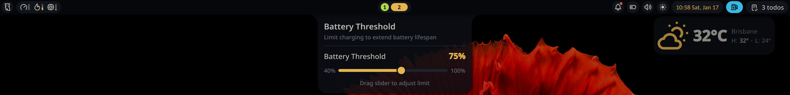

# Battery Threshold

A plugin for Noctalia Shell to control the battery threshold on laptops, helping extend battery lifespan. This plugin only works if your laptop supports charge threshold control (as exported by the kernel in sysfs). The plugin looks like this in action:



## Features

- **Bar Widget**: Shows current battery threshold in the bar
- **Panel**: Adjust battery threshold with a slider (40-100%)
- **Persistent Settings**: Saves and restores threshold across reboots

## Limitations

- Currently supports only the primary battery, which this plugin expects to
  have exposed as BAT0 by sysfs.

## Usage

Add the bar widget to your bar. Click to open the panel and adjust the battery threshold using the slider.

### Panel Controls

- Drag the slider to set battery threshold (40-100%)
- Changes are applied immediately
- Settings persist across reboots

## Setup (Required)

This plugin requires write access to the battery threshold file. Follow these steps to enable it:

### Step 1: Check group for your distro

The included udev rule uses the `wheel` group (Fedora/RHEL).

**For Debian/Ubuntu:** Edit `99-battery-threshold.rules` and change `wheel` to `plugdev` before installing.

### Step 2: Install udev rule

Copy the rule file to `/etc/udev/rules.d/`:

```bash
sudo cp 99-battery-threshold.rules /etc/udev/rules.d/
```

### Step 3: Reload udev rules

```bash
sudo udevadm control --reload-rules
sudo udevadm trigger --subsystem-match=power_supply
```

### Step 4: Verify group membership

Check your groups:
```bash
groups
```

If needed, add yourself to the appropriate group:
```bash
# Fedora/RHEL
sudo usermod -aG wheel $USER

# Debian/Ubuntu
sudo usermod -aG plugdev $USER
```

### Step 5: Log out and back in

Group changes require a new login session to take effect.

## Troubleshooting

- **Read-only mode**: Ensure udev rule is installed and you're in the correct group
- **Not available**: Your laptop may not support charge threshold control
- **Changes not saving**: Check write permissions on the sysfs file

## Requirements

- Laptop with battery charge threshold support (ThinkPad, ASUS, etc.)
- Noctalia 3.6.0 or later
- Tested on Asus Zenbook 14 UX3405
